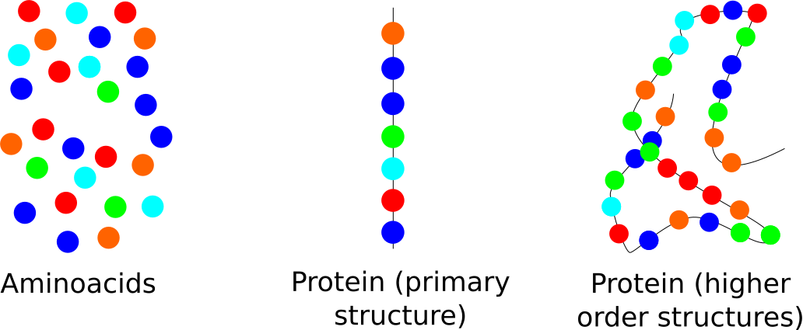
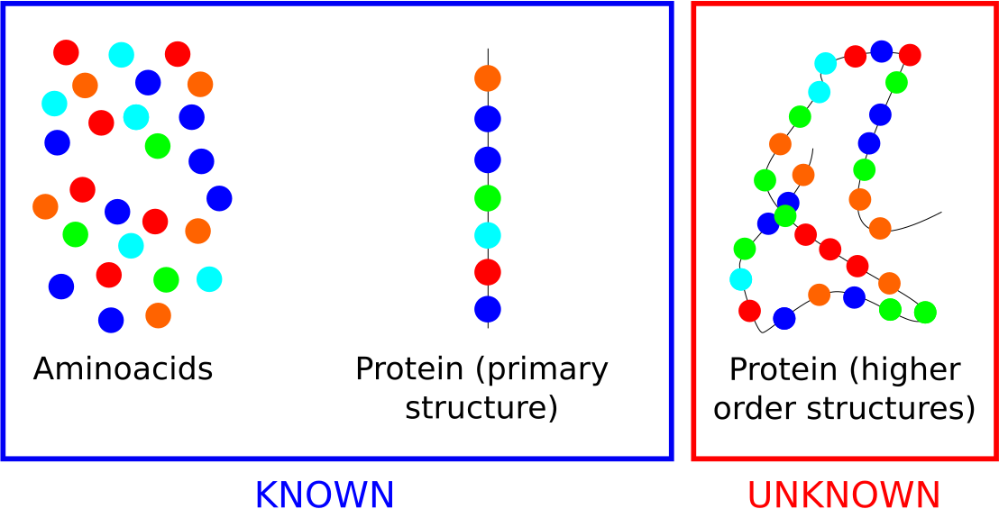
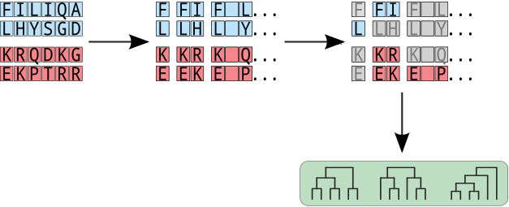
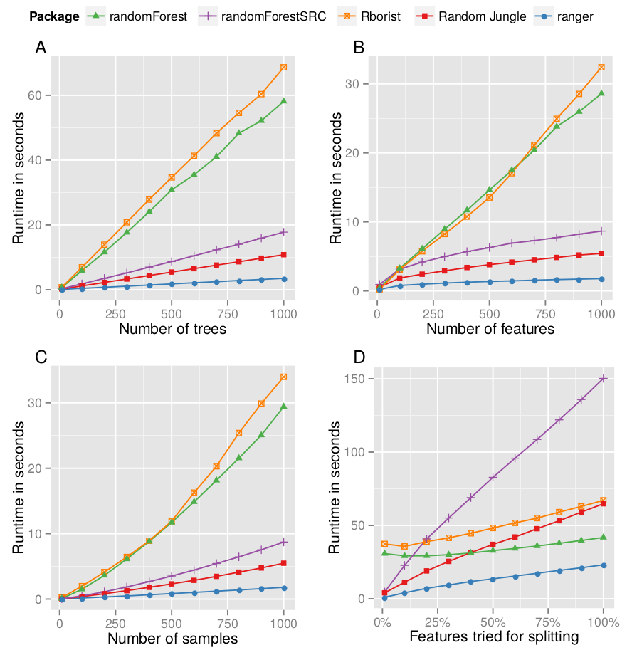
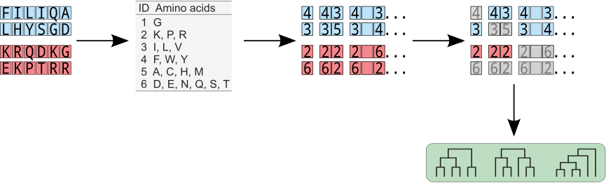
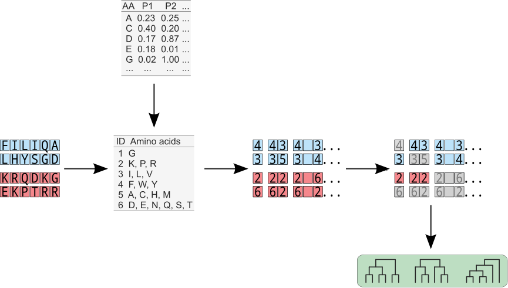
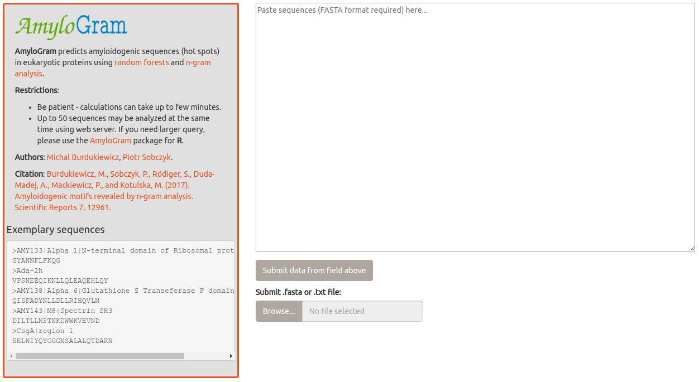
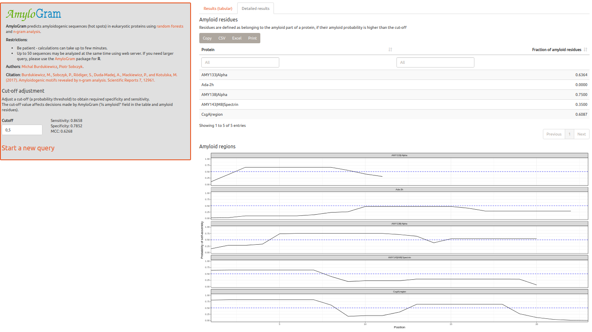

```{r setup, include=FALSE}
options(htmltools.dir.version = FALSE)

source("my_ggplot_theme.R")

library(dplyr)
library(reshape2)
library(xtable)
library(biogram)
library(seqinr)
library(VennDiagram)
library(crayon)
  
source("script.R")  

print_bt <- function(x) {
  rws <- 0L:(nrow(x) - 1)
  col <- c("\\rowcolor{green!10}", "\\rowcolor{blue!10}", "\\rowcolor{red!10}", "\\rowcolor{yellow!10}")
  print(xtable(x, digits = 0), booktabs = TRUE,
        add.to.row = list(pos = as.list(rws), command = col),
        print.results = FALSE)
}

print_bt2 <- function(x) {
  rws <- seq(1, nrow(x) - 1, by = 2)
  col <- rep("\\rowcolor[gray]{0.85}", length(rws))
  print(xtable(x, digits = 0), booktabs = TRUE,
        add.to.row = list(pos = as.list(rws), command = col),
        print.results = FALSE, include.rownames = FALSE)
}  
  
cls <- c("\\colorbox{green!10}", "\\colorbox{blue!10}", "\\colorbox{red!10}", "\\colorbox{yellow!10}")

group2df <- function(group_list, caption = NULL, label = NULL) {
  tab <- data.frame(Groups = sapply(group_list, function(i)
    paste0(toupper(sort(i)), collapse = ", ")))
  tab <- cbind(ID = 1L:nrow(tab), tab)
  rws <- seq(1, nrow(tab) - 1, by = 2)
  col <- rep("\\rowcolor[gray]{0.85}", length(rws))
  colnames(tab) <- c("Subgroup ID", "Amino acids")
  res <- print(xtable(tab, caption = caption, label = label), 
               include.rownames = FALSE, booktabs = TRUE,
               add.to.row = list(pos = as.list(rws), command = col), print.results = FALSE, 
               caption.placement = "top", sanitize.text.function = identity, 
               sanitize.rownames.function = identity)
  #res
  print(xtable(tab))
}  
  
amyloids_plot <- read.csv("amyloid_plot_data.csv")

levels(amyloids_plot[["et"]]) <- c("Best-performing reduced alphabet", 
                                   "Reduced alphabet", "Full alphabet", 
                                   "Standard reduced alphabet")


amyloids_plot[["len_range"]] <- factor(amyloids_plot[["len_range"]], 
                                       levels = c("Test peptide length: 6 ", "Test peptide length: 7-10", 
                                                  "Test peptide length: 11-15", "Test peptide length: 16-25"))

subdat <- filter(amyloids_plot, pos == "Training peptide length: 6")

best_enc <- list(c("G"), 
                 c("K", "P", "R"),
                 c("I", "L", "V"),
                 c("F", "W", "Y"),
                 c("A", "C", "H", "M"),
                 c("D", "E", "N", "Q", "S", "T"))
names(best_enc) <- 1L:6


```

# Proteins

## Amino acids
<!-- ## {data-background=static_figure/aminoacids.png data-background-size=92%} -->

<center>

</center>


<!-- Source: [https://www.compoundchem.com/2014/09/16/aminoacids/] -->


## Amino acids

```{r echo=FALSE, fig.height=5, fig.width=10}
dat <- aaprop[c("ARGP820101", "DAWD720101", "EISD840101", "GOLD730102"), ]
melt(dat) %>% 
  mutate(Var2 = toupper(Var2)) %>% 
  ggplot(aes(x = Var2, y = Var1, fill = value)) +
  geom_tile(color = "black") +
  scale_x_discrete("Amino acid")+
  scale_y_discrete("Feature") +
  scale_fill_gradient("Standardised value",
                      low = "#f7fcb9", high = "#31a354") +
  my_theme

```


## Proteins

<!--  -->
<center>

</center>


## Proteins

<center>

</center>


## Proteins

<center>

</center>

Protein higher order structures determines its function.


## Human proteom

```{r echo=FALSE, fig.height=4.5, fig.width=10}
library(waffle)

parts <- data.frame(
  names = c("Unknown role", "Known role"),
  vals = c(1937/100, (20230 - 1937)/100)
)

waffle(
  setNames(c(1937/100, (20230 - 1937)/100), 
           c("Unknown role", "Known role")), 
  rows = 8, size = 1, 
  colors = c("black", "#1879bf"), legend_pos = "bottom"
)

```

1937 human proteins have unknown role (dark proteome) (Young-Ki Paik et al., 2018).


## Goal

Development of methods for predicting protein properties on the basis of their primary structure in a way that is understandable for biologists and experimentally validated.


# n-grams and reduced alphabets

##

n-grams (k-tuple, k-mers):

- subsequences (continuous or discontinuous) _n_ amino acid or nucleotide residues,
- more informative than the individual residues

##

```{r echo=FALSE, fig.height=5, fig.width=10}

seq1 <- c("f", "k", "v", "w", "p", "d", "h", "g", "s", "g")
seq2 <- c("y", "m", "c", "i", "y", "r", "a", "q", "t", "n")

sample_seq <- matrix(toupper(c(seq1, seq2)), ncol = 10, byrow = TRUE)

# generate_ngrams <- function(x){
#   decode_ngrams(x) %>%
#   gsub("_", "-", x = .) %>%
#   paste0(paste0(colors, '("'), .) %>%
#   paste0(., '")') %>%
#   .[1L:4] %>%
#   paste0(collapse = ", ")}

# generate_ngrams <- function(x){
#   decode_ngrams(x) %>%
#   gsub("_", "-", x = .) %>%
#   paste0(paste0('<div class="', colors, '">'), .) %>%
#   paste0(., '</div>') %>%
#   .[1L:4] %>% 
#   paste0(collapse = ", ")}

generate_ngrams <- function(x){
  decode_ngrams(x) %>%
  gsub("_", "-", x = .) %>%
  paste0(paste0('<span style="color:', colors, '">'), .) %>%
  paste0(., '</span>') %>%
  .[1L:4] %>% 
  paste0(collapse = ", ")}

colors <- c("red", "blue")

przyklady <- list(seq2ngrams(sample_seq, 1, aa_v, d = 0), 
                  seq2ngrams(sample_seq, 2, aa_v, d = 0), 
                  seq2ngrams(sample_seq, 2, aa_v, d = 1), 
                  seq2ngrams(sample_seq, 3, aa_v, d = c(2, 0)))

colored_ngrams <- lapply(przyklady, generate_ngrams) 

# cat(colored_ngrams[[1]])
# cat(colored_ngrams[[2]])
# cat(colored_ngrams[[3]])
# cat(colored_ngrams[[4]])
```


Peptide I: <span style="color:red">FKVWPDHGSG</span>

Peptide II: <span style="color:blue">YMCIYRAQTN</span>


n-gram examples from peptide I and II:

- 1-gram: <span style="color:red">F</span>, <span style="color:blue">Y</span>, <span style="color:red">K</span>, <span style="color:blue">M</span>,
- 2-gram: <span style="color:red">FK</span>, <span style="color:blue">YM</span>, <span style="color:red">KV</span>, <span style="color:blue">MC</span>,
- 2-gram (discontinuous): <span style="color:red">F-V</span>, <span style="color:blue">Y-C</span>, <span style="color:red">K-W</span>, <span style="color:blue">M-I</span>,
- 3-gram (discontinuous): <span style="color:red">F--WP</span>, <span style="color:blue">Y--IY</span>, <span style="color:red">K--PD</span>, <span style="color:blue">M--YR</span>.


##
```{r echo=FALSE, fig.height=4.5, fig.width=10}
L <- 1
m <- 20 
m2 <- 6
n <- 1:5
n_max <- L*m^n
n_max2 <- L*m2^n
#dat <- data.frame(n = c(n, n), n_max = c(n_max, n_max2), m = c(rep(m, 5), rep(m2, 5)))
dat <- data.frame(n = n, n_max = n_max, m = rep(m, 5))
dat[["m"]] <- factor(dat[["m"]])

ggplot(dat, aes(x = n, y = n_max, color = m, label = formatC(n_max, digits = 4))) + 
  geom_line(linetype="dotted", size=1.5) + 
  geom_point(size=4, shape=16) +
  geom_text(size = 4, vjust = -1.5, hjust = "inward", color = "red") +
  coord_cartesian(ylim = c(1, 4.5e7)) +
  scale_x_continuous("Length of continuous n-gram (n)", breaks = 0L:5) +
  scale_y_continuous("Number of potential n-grams (logarithmic scale)",
                     trans = "log10") +
  scale_color_discrete("Size of the alphabet") +
  my_theme
```


Longer n-grams are more informative, but create larger attribute spaces that are more difficult to analyze.


## slam: Sparse Lightweight Arrays and Matrices

```{r echo=FALSE, fig.height=4.5, fig.width=10, message=FALSE}
library(slam)
library(xtable)
library(ggplot2)
library(tidyverse)

load("data/slam.RData")

# xtable(do.call(rbind, lapply(10^(0L:4), function(i) {
#   m <- diag(1, i)
#   data.frame(m = i,
#              storage = c("base", "slam"),
#              value = c(format(object.size(m), units = "Mb", digits = 6),
#                        format(object.size(as.simple_triplet_matrix(m)), units = "Mb", digits = 6)))
# }))
# )
# 
# p <- do.call(rbind, lapply((0L:10^4), function(i) {
#   m <- diag(1, i)
#   data.frame(m = i,
#              storage = c("base", "slam"),
#              value = c(format(object.size(m), units = "Mb", digits = 6),
#                        format(object.size(as.simple_triplet_matrix(m)), units = "Mb", digits = 6)))
# }))
# 
# p[["value"]] <- as.numeric(lapply(p$value, function(i) {gsub(" Mb", "", i)}))


p %>% ggplot(aes(x = m, y = value, color = storage)) +
  geom_jitter() + 
  my_theme +
  scale_y_continuous("File size [Mb]") +
  scale_x_continuous("Number of sparse matrices") +
  scale_color_manual("Package", values = c("red", "blue"))

# format(object.size(as.simple_triplet_matrix(diag(1, 500))), units = "Kb")

# format(object.size(diag(1, 10^5)), units = "Mb", digits = 6)
# Error: cannot allocate vector of size 74.5 Gb
# 
# format(object.size(diag(1, 10^6)), units = "Mb", digits = 6)
# Error: cannot allocate vector of size 7450.6 Gb
```

Counting n-grams creates sparse matrices, that are causing dimensional problems. 

## slam: Sparse Lightweight Arrays and Matrices

```{r echo=FALSE, fig.height=4.5, fig.width=10}
library(slam)
library(knitr)

# load("data/slam.RData")

p <- do.call(rbind, lapply(10^(0L:4), function(i) {
  m <- diag(1, i)
  data.frame(m = i,
             storage = c("base", "slam"),
             value = c(format(object.size(m), units = "Mb", digits = 6),
                       format(object.size(as.simple_triplet_matrix(m)), units = "Mb", digits = 6)))
}))

names(p) <- c("Number of sparse matrices", "Package", "File size [Mb]")

kable(p)

```


## Reduced alphabets

Reduced alphabets:

- amino acids are grouped into larger yields on the basis of specific criteria,
- easier anticipation of structures [@murphy_simplified_2000],
- creation of more generalised models.


## Reduced alphabets

Following peptides appear to be completely different in terms of amino acid composition.

<br></br>

Peptide I: 

FKVWPDHGSG

<br></br>

Peptide II: 

YMCIYRAQTN

##
```{r echo=FALSE, fig.height=5, fig.width=10, message=FALSE, warning=FALSE}
seq_dat <- rbind(data.frame(seq = "Sequence I", pos = 1L:10, 
                            aa = seq1, val = aaprop["ARGP820101", seq1]),
                 data.frame(seq = "Sequence II", pos = 1L:10, 
                            aa = seq2, val = aaprop["ARGP820101", seq2])) %>% 
  mutate(hydroph = val < 0.4)

ggplot(seq_dat, aes(x = factor(pos), y = val, label = toupper(aa), 
                    group = seq, colour = hydroph)) +
  geom_text(vjust = "outward", size = 4.8, show_guide = FALSE, fontface = "bold") +
  #geom_point(size = 0) +
  geom_line(linetype = "dotted", color = "black") +
  facet_wrap(~ seq, ncol = 1) +
  scale_x_discrete("Position") +
  scale_y_continuous("Hydrophobicity (Argos et al., 1982)", expand = c(.1, .1)) +
  scale_color_manual(values = c("green", "orange")) +
  #guides(colour = guide_legend(override.aes = list(size=4))) +
  my_theme 
```


##


| Group | Amino acids |
|:-:	|:-: |
| 1 | <span style="color:green">C, I, L, K, M, F, P, W, Y, V</span> |
| 2 | <span style="color:orange">A, D, E, G, H, N, Q, R, S, T</span> |

<br/><br/>
<br/><br/>

<p align="justify">
Peptide I: &nbsp;&nbsp;&nbsp;&nbsp;&nbsp;&nbsp; <span style="color:green">FKVWP</span><span style="color:orange">DHGSG</span>  &nbsp;&nbsp;&nbsp;&nbsp;&nbsp;&nbsp; ----->  &nbsp;&nbsp;&nbsp;&nbsp;&nbsp;&nbsp;  <span style="color:green">11111</span><span style="color:orange">22222</span>

Peptide II:  &nbsp;&nbsp;&nbsp;&nbsp;&nbsp;&nbsp; <span style="color:green">YMCIY</span><span style="color:orange">RAQTN</span>  &nbsp;&nbsp;&nbsp;&nbsp;&nbsp;&nbsp;&nbsp; ----->  &nbsp;&nbsp;&nbsp;&nbsp;&nbsp;&nbsp;  <span style="color:green">11111</span><span style="color:orange">22222</span>
</p>


# Amyloid prediction

## Amyloids


<small>Amyloid aggregates are found in tissues of people suffering from neurodegenerative disorders such as Alzheimer's disease, Parkinson's disease and many other diseases.</small>

<center>

</center>

<small>Amyloid aggregates (red) around neurons (green). Strittmatter Laboratory, Yale University.</small>


## Amyloids

<center>

</center>

<small>Source: National Institute on Aging (NIA) | National Institutes of Health (NIH)</small>


  
## Amyloid proteins

Peptide sequences with amyloidogenic properties are responsible for the aggregation of amyloidogenic proteins (hot spots):

- short (6-15 amino acids),
- very variable, usually hydrophobic amino acid composition,
- create unique $\beta$-structures.

<center>

</center>

[@sawaya_atomic_2007]


# AmyloGram: n-gram-based amyloid prediction tool

[@burdukiewicz_prediction_2016; @BurdukiewiczAmyloidogenicmotifsrevealed2017a]


##
<br></br>

<center>

</center>

<br></br><br></br>


<small><small> Burdukiewicz, M., Sobczyk, P., Rödiger, S., Duda-Madej, A., Mackiewicz, P., and Kotulska, M. (2017). Amyloidogenic motifs revealed by n-gram analysis. Scientific Reports 7, 12961 </small></small>  


## QuiPT

```{r echo=FALSE, fig.height=5, fig.width=10}
load("data/times2.RData")

times_dat <- do.call(rbind, lapply(times, function(i) 
  t(sapply(i, function(j) {
    c(slow = unname(j[["slow"]]["elapsed"]),
      quick = unname(j[["quick"]]["elapsed"]))
  }))
)) %>% 
  data.frame %>% 
  mutate(size = sort(rep(1L:5*10, 10))) %>% 
  melt(id.vars = "size") %>% 
  group_by(size, variable) %>% 
  summarise(value = mean(value)) %>% 
  ungroup %>% 
  mutate(variable = factor(variable, labels = c("Permutation test", "QuiPT")))

ggplot(times_dat, aes(x = size, y = value, color = variable)) +
  geom_point(size = 4) +
  geom_line(linetype = "dotted") +
  scale_y_continuous("Time [s]") +
  scale_x_continuous("Number of tested n-grams") +
  scale_color_manual("Test", values = c("red", "blue")) +
  my_theme
```

<span style="color:red">Qui</span>ck <span style="color:red">P</span>ermutation <span style="color:red">T</span>est is a fast alternative to permutation tests for n-gram data. It also allows precise estimation of p-value.

QuiPT is avaible as part of the *biogram* R package.


## ranger: A Fast Implementation of Random Forests

| Package || Runtime [h] || Memory usage [GB] |
|:-:	|:-: |:-:	|:-: |:-:	|
||| mtry= |||
|| 5000 | 15,000 | 135,000 ||
| randomForest | 101.24 | 116.15 | 248.60 | 39.05 | 
| randomForest (MC) | 32.10 | 53.84 | 110.85 | 105.77 | 
| bigrf | NA | NA | NA | NA |
| randomForestSRC | 1.27 | 3.16 | 14.55 | 46.82 |
| Random Jungle | 1.51 | 3.60 | 12.83 | 0.40 |
| Rborist | NA | NA | NA | >128 |
| ranger | 0.56 | 1.05 | 4.58 | 11.26 | 
| ranger (save.memory) | 0.93 | 2.39 | 11.15 | 0.24 |
| ranger (GWAS mode) | 0.23 | 0.51 | 2.32 | 0.23 |


<small><small>Runtime and memory usage for the analysis of a simulated dataset mimicking a
genome-wide association study (GWAS). NA values indicate unsuccessful analyses:<br></br> 
without disk caching failed because of memory shortage for all mtry values and number of
CPU cores. <br></br>
With disk caching, we stopped bigrf after 16 days of computation.}</small></small> 

<br></br>

<small><small>Marvin N. Wright and Andreas Ziegler. (2017). ranger: A Fast Implementation of Random Forests for High Dimensional Data in C++ and R. Journal of Statistical Software 1, 77
</small></small> 


## 

<center>

</center>

<small><small>Marvin N. Wright and Andreas Ziegler. (2017). ranger: A Fast Implementation of Random Forests for High Dimensional Data in C++ and R. Journal of Statistical Software 1, 77</small></small> 


## Cross-validation
```{r echo=FALSE, fig.height=5, fig.width=10}

levels(subdat[["len_range"]]) <- c("Training set (peptides with a length of 6)", 
                                   "Training set (peptides with a length of 7-10)", 
                                   "Training set (peptides with a length of 11-15)", 
                                   "Training set (peptides with a length of 16-25)")

levels(subdat[["et"]]) <-  c("Best-performing reduced alphabet", "Reduced alphabet", 
                             "Full alphabet", "Standard reduced alphabet")

ggplot(subdat, aes(x = len_range, y = AUC_mean)) +
  geom_boxplot(outlier.color = NA, outlier.shape = 16, outlier.size = 3, color = NA, fill = NA) +
  geom_point(data = filter(subdat, et == "Full alphabet"), 
             aes(x = len_range, y = AUC_mean, color = et, shape = et), size = 3) +
  scale_x_discrete("") +
  scale_y_continuous("Average AUC") +
  scale_shape_manual("", values = c(16, 16, 15, 15)[3], drop = TRUE) +
  scale_color_manual("", values = c("red", "grey", "green", "blue")[3], drop = TRUE) +
  guides(color = guide_legend(nrow = 2), shape = guide_legend(nrow = 2)) + 
  #facet_wrap(~ pos, nrow = 3) +
  ggtitle("Training set (peptides with a length of 6)") + 
  my_theme + 
  coord_flip()

```
<!-- %AUC (Area Under the Curve) measures the performance of a classifier (1 - classifier always properly recognizes amyloid proteins, 0 - classifier never properly recognizes amyloid proteins). -->

<br></br>

<small><small> Burdukiewicz, M., Sobczyk, P., Rödiger, S., Duda-Madej, A., Mackiewicz, P., and Kotulska, M. (2017). Amyloidogenic motifs revealed by n-gram analysis. Scientific Reports 7, 12961 </small></small> 


## Standard reduced alphabets

Do standard reduced alphabets developed for different biological issues help to improve amyloid prediction?


  
## Standard reduced alphabets

<center>

</center>

<br></br>

<small><small> Burdukiewicz, M., Sobczyk, P., Rödiger, S., Duda-Madej, A., Mackiewicz, P., and Kotulska, M. (2017). Amyloidogenic motifs revealed by n-gram analysis. Scientific Reports 7, 12961 </small></small> 


## Standard reduced alphabet

```{r echo=FALSE, fig.height=5, fig.width=10}
ggplot(subdat, aes(x = len_range, y = AUC_mean)) +
  geom_boxplot(outlier.color = NA, outlier.shape = 16, outlier.size = 3, color = NA, fill = NA) +
  geom_point(data = filter(subdat, et %in% c("Full alphabet", "Standard reduced alphabet")), 
             aes(x = len_range, y = AUC_mean, color = et, shape = et), size = 3) +
  scale_x_discrete("") +
  scale_y_continuous("Average AUC") +
  scale_shape_manual("", values = c(16, 16, 15, 15)[3L:4], drop = TRUE) +
  scale_color_manual("", values = c("red", "grey", "green", "blue")[3L:4], drop = TRUE) +
  guides(color = guide_legend(nrow = 2), shape = guide_legend(nrow = 2)) + 
  #facet_wrap(~ pos, nrow = 3) +
  ggtitle("Training set (peptides with a length of 6)") + 
  my_theme + 
  coord_flip()

```

Standard amino acid alphabets do not improve the quality of amyloid prediction.

<!-- % Standard reduced amino acid alphabets do not enhance discrimination between amyloidogenic and non-amyloidogenic proteins. -->

<br></br>

<small><small> Burdukiewicz, M., Sobczyk, P., Rödiger, S., Duda-Madej, A., Mackiewicz, P., and Kotulska, M. (2017). Amyloidogenic motifs revealed by n-gram analysis. Scientific Reports 7, 12961 </small></small> 


## Novel reduced amino acid alphabets

17 measures handpicked from AAIndex database: 

- size of residues, 

- hydrophobicity, 

- solvent surface area, 

- frequency in $\beta$-sheets,

- contactivity.

<br></br>
524 284 amino acid reduced alphabets with different level of amino acid alphabet reduction (three to six amino acid groups).


<br></br><br></br>

<small><small> Burdukiewicz, M., Sobczyk, P., Rödiger, S., Duda-Madej, A., Mackiewicz, P., and Kotulska, M. (2017). Amyloidogenic motifs revealed by n-gram analysis. Scientific Reports 7, 12961 </small></small> 
  
## Novel reduced amino acid alphabets

<center>

</center>

<br></br>

<small><small> Burdukiewicz, M., Sobczyk, P., Rödiger, S., Duda-Madej, A., Mackiewicz, P., and Kotulska, M. (2017). Amyloidogenic motifs revealed by n-gram analysis. Scientific Reports 7, 12961 </small></small> 


## Standard reduced alphabet

```{r echo=FALSE, fig.height=5, fig.width=10}
subdat2 <- droplevels(filter(subdat, et != "Best-performing reduced alphabet"))

ggplot(subdat2, aes(x = len_range, y = AUC_mean)) +
  geom_boxplot(outlier.color = "grey", outlier.shape = 16, outlier.size = 3, color = "black", fill = "white") +
  geom_point(data = filter(subdat2, et %in% c("Full alphabet", "Standard reduced alphabet")), 
             aes(x = len_range, y = AUC_mean, color = et, shape = et), size = 3) +
  scale_x_discrete("") +
  scale_y_continuous("Średnie AUC") +
  scale_shape_manual("", values = c(16, 16, 15, 15)[2L:4], drop = FALSE) +
  scale_color_manual("", values = c("red", "grey", "green", "blue")[2L:4], drop = FALSE) +
  guides(color = guide_legend(nrow = 2), shape = guide_legend(nrow = 2)) + 
  #facet_wrap(~ pos, nrow = 3) +
  ggtitle("Training set (peptides with a length of 6)") + 
  my_theme + 
  coord_flip()

```


<!-- %Hinges of boxes correspond to  -->
<!-- %the 0.25 and 0.75 quartiles. The bar inside the box represents the median. The  -->
<!-- %gray circles correspond to the reduced alphabets with the AUC outside the 0.95  -->
<!-- %confidence interval. -->

<br></br>

<small><small> Burdukiewicz, M., Sobczyk, P., Rödiger, S., Duda-Madej, A., Mackiewicz, P., and Kotulska, M. (2017). Amyloidogenic motifs revealed by n-gram analysis. Scientific Reports 7, 12961 </small></small> 
  

## Selection of best-performing reduced alphabet

```{r echo=FALSE, fig.height=5, fig.width=10, message=FALSE}

set.seed(3)
exdat <- data.frame(
  alph = paste0("A", 1L:5), 
  c1 = 0.7 + runif(5)/5,
  c2 = 0.75 + runif(5)/5,
  c3 = 0.65 + runif(5)/5
) %>% 
  melt %>% 
  group_by(variable) %>% 
  mutate(r = rank(value)) %>% 
  ungroup

best_alph <- group_by(exdat, alph) %>%
  summarise(cr = sum(r)) %>%
  arrange(desc(cr)) %>% 
  slice(1) %>% 
  select(alph) %>% 
  unlist %>% 
  as.character

exdat <- mutate(exdat, best = ifelse(alph == best_alph, "yes", "no"))

ggplot(exdat, aes(y = variable, x = value, color = alph)) +
  geom_point(size = 7) +
  scale_x_continuous("AUC") +
  scale_y_discrete("Category", labels = paste0("Category ", 1L:3)) +
  scale_color_discrete("Alphabet") +
  my_theme

```


## Selection of best-performing reduced alphabet

```{r echo=FALSE, fig.height=5, fig.width=10, message=FALSE}
ggplot(exdat, aes(y = variable, x = value, color = alph, label = (r - 6)*-1)) +
  geom_text(size = 7) +
  scale_x_continuous("AUC") +
  scale_y_discrete("Category", labels = paste0("Category ", 1L:3)) +
  scale_color_discrete("Alphabet") +
  scale_shape_discrete("best-performing reduced alphabet") +
  my_theme
```

For each category the alphabets have been ranked (rank 1 for the best AUC, etc.). 


## Selection of best-performing reduced alphabet

```{r echo=FALSE, fig.height=5, fig.width=10}
ggplot(exdat, aes(y = variable, x = value, color = alph, shape = best)) +
  geom_point(size = 7) +
  scale_x_continuous("AUC") +
  scale_y_discrete("Category", labels = paste0("Category ", 1L:3)) +
  scale_color_discrete("Alphabet") +
  scale_shape_discrete("best-performing reduced alphabet") +
  my_theme +
  theme(legend.box = "vertical")
```

The best alphabet was the one with the lowest rank sum.

  
## Best-performing reduced alphabet

```{r echo=FALSE, fig.height=5, fig.width=10}

ggplot(subdat, aes(x = len_range, y = AUC_mean)) +
  geom_boxplot(outlier.color = "grey", outlier.shape = 16, outlier.size = 3) +
  geom_point(data = filter(subdat, et != "Reduced alphabet"), 
             aes(x = len_range, y = AUC_mean, color = et, shape = et), size = 3) +
  scale_x_discrete("") +
  scale_y_continuous("Average AUC") +
  scale_shape_manual("", values = c(16, 16, 15, 15), drop = FALSE) +
  scale_color_manual("", values = c("red", "grey", "green", "blue"), drop = FALSE) +
  guides(color = guide_legend(nrow = 2), shape = guide_legend(nrow = 2)) + 
  #facet_wrap(~ pos, nrow = 3) +
  ggtitle("Training set (peptides with a length of 6)") + 
  my_theme + 
  coord_flip()
```

<br></br>

<small><small> Burdukiewicz, M., Sobczyk, P., Rödiger, S., Duda-Madej, A., Mackiewicz, P., and Kotulska, M. (2017). Amyloidogenic motifs revealed by n-gram analysis. Scientific Reports 7, 12961 </small></small> 

## Best-performing reduced alphabet

```{r echo=FALSE, fig.height=5, fig.width=10}
# cat(group2df(best_enc, caption = "The best-performing reduced alphabet."))
```


|Group|Amino acids|
|:-:	|:-: |
|1|G|
|2|<span style="color:red">K, P, R</span>|
|3|<span style="color:blue">I, L, V</span>|
|4|<span style="color:blue">F, W, Y</span>|
|5|A, C, H, M|
|6|D, E, N, Q, S, T|


Group 3 & 4 - hydrophobic amino acids.  

Group 2 - amino acids disrupting the $\beta$-structure ($\beta$-breakers). 


<br></br>

<small><small> Burdukiewicz, M., Sobczyk, P., Rödiger, S., Duda-Madej, A., Mackiewicz, P., and Kotulska, M. (2017). Amyloidogenic motifs revealed by n-gram analysis. Scientific Reports 7, 12961 </small></small> 

## Alphabet similarity and quality of prediction

<!-- % Czy alfabety podobne do najlepszego uproszczonego alfabetu również wspierają przewidywania amyloidów? -->
<!-- % Do alphabets similar to the best reduced alphabet also support amyloid predictions? -->
Is the best-performing reduced amino acid alphabet associated with amyloidogenicity?


## Similarity index

```{r echo=FALSE, fig.height=5, fig.width=10}
si_dat <- read.csv2("si_dat.csv")

levels(si_dat[["et"]]) <- c("Best-performing reduced alphabet", "Reduced alphabet", 
                             "Full alphabet", "Standard reduced alphabet", 
                            "Standard reduced alphabet")


simil_plot <- ggplot(si_dat, aes(x=si, y=AUC_mean)) + 
  # geom_point(data = si_dat, 
  #            aes(x = si, y = AUC_mean, color = et, shape = et), size = 4) +
  #geom_density_2d(color = "black", contour = TRUE) +
    geom_bin2d(bins = 30) +
  # stat_density2d(aes(fill=..level..), color = "black",
  #                contour = TRUE, geom = "polygon", alpha = 0.5, binwidth = 50, bins = 10) +
  scale_fill_continuous("Number of alphabets", low = "gold", high = "goldenrod4") +
  xlab("Similarity index") +
  ylab("AUC") +
  my_theme +
  geom_point(data = droplevels(filter(si_dat, et != "Reduced alphabet")),
             aes(x = si, y = AUC_mean, color = et, shape = et), size = 4) +
  guides(color = guide_legend(nrow = 2), shape = guide_legend(nrow = 2), 
         fill = guide_colorbar(barwidth = unit(5, "line"))) +
  scale_shape_manual("", values = c(16, 15, 15), drop = FALSE) +
  scale_color_manual("", values = c("red", "green", "blue"), drop = FALSE) +
  theme(panel.grid.major = element_line(color = "lightgrey", size = 0.5)) 

print(simil_plot)
```

Similarity index [@stephenson_unearthing_2013] measures the similarity between two reduced alphabets (1:~identical alphabets, 0:~completely dissimilar alphabets).


## Similarity index

```{r echo=FALSE, fig.height=5, fig.width=10}
print(simil_plot)
```

The correlation between the similarity index and the average AUC is important ($\textrm{p-value} \leq 2.2^{-16}$; $\rho = 0.51$).

<br></br>

<small><small> Burdukiewicz, M., Sobczyk, P., Rödiger, S., Duda-Madej, A., Mackiewicz, P., and Kotulska, M. (2017). Amyloidogenic motifs revealed by n-gram analysis. Scientific Reports 7, 12961 </small></small> 

## 
<!-- % Are the informative n-grams found by QuiPT are connected with amyloidogenicity? -->
Are informative n-grams found by QuiPT associated with amyloidogenicity?


<!-- ## Informative n-grams -->

<!-- ```{r echo=FALSE, fig.height=5, fig.width=10} -->
<!-- ngram_freq <- read.csv("ngram_freq.csv") -->

<!-- ngram_freq_plot <- mutate(ngram_freq, decoded_name = gsub("_", "-", decoded_name)) %>% -->
<!--   mutate(decoded_name = factor(decoded_name, levels = as.character(decoded_name)), -->
<!--          amyloid = diff_freq > 0) %>% -->
<!--   melt() %>% -->
<!--   filter(variable %in% c("pos", "neg"), -->
<!--          association != "Not found") %>% -->
<!--   droplevels %>% -->
<!--   mutate(variable = factor(variable, labels = c("Amyloid", "Non-amyloid"))) -->

<!-- ggplot(ngram_freq_plot, aes(x = decoded_name, y = value)) + -->
<!--   geom_bar(aes(fill = variable), position = "dodge", stat = "identity") + -->
<!--   geom_point(data = group_by(ngram_freq_plot, decoded_name)  %>% filter(value == max(value)), -->
<!--              aes(y = value + 0.004, shape = association), size = 6) + -->
<!--   scale_fill_manual("", values = c("gold", "darkmagenta")) + -->
<!--   scale_shape_manual("Motif:", breaks = c("Amyloidogenic", "Non-amyloidogenic"), values = c(16, 17, NA)) + -->
<!--   scale_y_continuous("Frequency") + -->
<!--   scale_x_discrete("") + -->
<!--   my_theme + -->
<!--   theme(panel.grid.major.y = element_line(color = "lightgrey", size = 0.5))  -->

<!-- ``` -->

<!-- Out of 65 the most informative n-grams, 15 (23\%) were also found in the motifs validated experimentally [@paz_sequence_2004]. -->


## Informative n-grams

```{r echo=FALSE, fig.height=5, fig.width=10, message=FALSE}
ngram_freq <- read.csv("ngram_freq.csv")

ngram_freq_plot <- mutate(ngram_freq, decoded_name = gsub("_", "-", decoded_name)) %>%
  mutate(decoded_name = factor(decoded_name, levels = as.character(decoded_name)),
         amyloid = diff_freq > 0) %>%
  melt() %>%
  filter(variable %in% c("pos", "neg"),
         association != "Not found") %>%
  droplevels %>%
  mutate(variable = factor(variable, labels = c("Amyloid", "Nonamyloid")),
         association = factor(association, levels = c("Amyloidogenic", "nonamyloidogenic")))

select(ngram_freq_plot, -association) %>% 
  dcast(decoded_name ~ variable) %>% 
  mutate(log_odd = log(Amyloid/Nonamyloid)) %>% 
  ggplot(aes(x = decoded_name, y = log_odd)) +
  geom_col() +
  scale_y_continuous("Log odds ratio") +
  scale_x_discrete("") +
  my_theme  

```

<!-- % Spośród 65 najbardziej informatywnych n-gramów, 15 (23\%) jest również obecnych w motywach aminokwasowych znalezionych ekperymentalnie [@paz_sequence_2004]. -->

Of the 65 most informative n-grams, 15 (23\%) are also present in amino acid motifs found experimentally [@paz_sequence_2004].

<br></br>
<small><small> Burdukiewicz, M., Sobczyk, P., Rödiger, S., Duda-Madej, A., Mackiewicz, P., and Kotulska, M. (2017). Amyloidogenic motifs revealed by n-gram analysis. Scientific Reports 7, 12961 </small></small> 


## Benchmark results

<br></br>

|Program | AUC | MCC|
|:-:	|:-: |:-:	|
|PASTA 2.0 [@walsh_pasta_2014] | 0.8550 | 0.4291|
|FoldAmyloid [@garbuzynskiy_foldamyloid:_2010] | 0.7351 | 0.4526|
|APPNN [@familia_prediction_2015] | 0.8343 | 0.5823|


<small>The classifier trained using the best reduced alphabet, AmyloGram, has been compared with other amyloid prediction tools using an external dataset \textit{pep424}.</small>

<small>MCC (Matthew's Correlation Coefficient) measures the performance of a classifier (1 - classifier always properly recognizes amyloid proteins, -1 - classifier never properly recognizes amyloid proteins)</small>

<br></br>

<small><small> Burdukiewicz, M., Sobczyk, P., Rödiger, S., Duda-Madej, A., Mackiewicz, P., and Kotulska, M. (2017). Amyloidogenic motifs revealed by n-gram analysis. Scientific Reports 7, 12961 </small></small> 


<!-- ## Experimental validation -->

<!-- <center> -->
<!--  -->
<!-- </center> -->

<!-- ## Experimental validation -->

<!-- <center> -->
<!--  -->
<!-- </center> -->

## New amyloid

<center>

</center>

A new functional amyloid produced by Methanospirillum sp. [@10.3389/fmicb.2018.02729] was selected for \textit{in vitro} analysis by AmyloGram.


# Shiny aplication

## AmyloGram web server

<center>

</center>

## AmyloGram web server

<center>

</center>

## AmyloGram web server

<center>

</center>

\begin{frame}{Summary}

Web servers:

- [http://www.smorfland.uni.wroc.pl/shiny/AmyloGram/].


<span style="color:red">R</span> packages:

- AmyloGram: [https://cran.r-project.org/package=AmyloGram].
- biogram [https://cran.r-project.org/package=biogram].
- signalHsmm: [https://cran.r-project.org/package=signalHsmm].


# Summary
## Summary

<!-- % Modele przewidujące właściwości białek mogą opierać się na regułach precyzyjnych zrozumiałych dla biologów i weryfikowalnych eksperymentalnie nie tracąc na swojej skuteczności. -->
Models predicting the properties of proteins may be based on precise rules that are understandable to biologists and experimentally verifiable without losing their effectiveness.


## Acknowledgements


- Michał Burdukiewicz (Warsaw University of technology).

- Małgorzata Kotulska (Wrocław University of Science and Technology).

- Stefan Rödiger (Brandenburg University of Technology Cottbus-Senftenberg).

- Paweł Mackiewicz (University of Wrocław).

- Piotr Sobczyk (Wrocław University of Science and Technology).


## Acknowledgements

Funding:

- Polish National Science Centre (2015/17/N/NZ2/01845 & 2017/24/T/NZ2/00003).

- COST ACTION CA15110 (Harmonising standardisation strategies to increase efficiency and competitiveness of European life-science research).

- KNOW Wrocław Center for Biotechnology.

- German Federal Ministry of Education and Research (InnoProfile-Transfer-Projekt 03IPT611X).

## References

<small><small>